```mermaid
graph LR
    Field[📝 Form Field] --> Context[🔍 Context Analysis]
    Context --> AI{🧠 AI Available?}
    
    AI -->|Yes| Gemini[🤖 Google Gemini<br/>Context-Aware Generation]
    AI -->|No| Rules[📋 Rule-Based<br/>Pattern Matching]
    
    Gemini --> Smart[🎯 Smart Data]
    Rules --> Faker[🎭 Faker Library]
    Faker --> Realistic[📊 Realistic Data]
    
    Smart --> Validate[✅ Validation]
    Realistic --> Validate
    
    Validate --> Output[📤 Final Value]
```

# FormGenius - AI-Powered Form Automation Agent 🤖✨

FormGenius is an intelligent AI agent that automatically detects, analyzes, and fills out web forms with realistic test data. It specializes in both traditional HTML forms and modern applications like Microsoft Power Apps, using advanced AI and browser automation for comprehensive form testing.

## ✨ What FormGenius Does

FormGenius automates the entire form testing workflow:

1. **🔍 Smart Detection**: Automatically finds and analyzes all forms on any webpage
2. **🧠 AI Analysis**: Uses Google's Gemini AI to understand form context and purpose
3. **📝 Data Generation**: Creates intelligent, contextual test data using AI-first approach with Faker fallback
4. **🎯 Intelligent Filling**: Fills forms just like a human user would
5. **✅ Validation Testing**: Tests edge cases, invalid data, and form validation
6. **📊 Comprehensive Reporting**: Generates detailed reports with screenshots

## 🚀 Key Features

- **🎯 Smart Form Detection**: Automatically identifies and analyzes web forms using advanced selectors
- **🧠 AI-Powered Data Generation**: Uses Google Gemini AI with Faker library fallback for reliable, contextual test data
- **🔎 Page Context Analysis**: Intelligently reads and uses test credentials or instructions displayed on the page
- **🏢 Power Apps Support**: Specialized support for Microsoft Power Apps with Office 365 authentication
- **🎭 Playwright Integration**: Robust browser automation using Microsoft's Playwright
- **📋 Multiple Test Scenarios**: Valid data, invalid data, edge cases, and security testing
- **⚡ Batch Processing**: Fill multiple forms simultaneously with intelligent concurrency
- **📊 Rich Reporting**: HTML and JSON reports with screenshots and detailed metrics
- **🖥️ CLI Interface**: Easy-to-use command-line interface with helpful guidance
- **⚙️ Highly Configurable**: YAML-based configuration with environment variable support
- **🔐 Secure Authentication**: Built-in Microsoft Office 365 authentication with 2FA support

## 🎯 How FormGenius Works

FormGenius follows an intelligent, multi-stage process to handle any web form:

### 🔄 The FormGenius Workflow

```mermaid
graph TD
    A[🌐 Navigate to URL] --> B1[📄 Analyze Page Context]
    B1 --> B2[🔍 Scan Page for Forms]
    B2 --> C{📝 Forms Found?}
    C -->|Yes| D[🧠 AI Analysis]
    C -->|No| E[❌ No Forms Detected]
    
    D --> F[📊 Form Classification]
    F --> G{🏢 Power Apps?}
    
    G -->|Yes| H[🔐 Check Authentication]
    G -->|No| I[📝 Standard Form Processing]
    
    H --> J{🔑 Authenticated?}
    J -->|No| K[🔐 Trigger Auth Setup]
    J -->|Yes| L[🎯 Power Apps Processing]
    
    I --> M[🎲 Generate Test Data]
    L --> M
    
    M --> N[📝 Fill Form Fields]
    N --> O[✅ Validate Results]
    O --> P[📊 Generate Report]
    
    K --> Q[⏸️ Pause for Authentication]
    Q --> R[🔄 Resume After Auth]
    R --> L
```



### 🧩 Core Components Architecture


## 🔍 Form Detection Process

FormGenius uses a sophisticated multi-layer detection system:

### 1. **Traditional HTML Forms**
```javascript
// Standard form selectors
selectors: [
    'form',                    // Basic HTML forms
    '[role="form"]',          // Accessible forms
    '[data-testid*="form"]',  // Test-friendly forms
    '.form-container'         // Common CSS patterns
]
```

### 2. **Dynamic & JavaScript Forms**
```javascript
// Dynamic form detection
containers: [
    '[class*="form"]',        // CSS class patterns
    '[id*="form"]',          // ID patterns
    'div:has(input)',        // Container detection
    '[data-form-id]'         // Data attributes
]
```

### 3. **Power Apps Forms**
```javascript
// Power Apps specific selectors
powerApps: [
    '[data-control-name]',     // Power Apps controls
    '.appmagic-control',       // Internal classes
    '[class*="powerapps"]',    // Framework classes
    '[role="textbox"]'         // ARIA roles
]
```

## 🧠 AI-Powered Data Generation

FormGenius combines rule-based and AI-powered data generation for maximum realism:

### Data Generation Flow



### Supported Data Types

| Field Type | AI Generation | Faker Fallback | Example Output |
|------------|---------------|----------------|----------------|
| 📧 Email | Context-aware domains | `faker.email()` | `john.doe@company.com` |
| 👤 Names | Cultural context | `faker.name()` | `Sarah Johnson` |
| 📱 Phone | Regional formats | `faker.phone_number()` | `+1 (555) 123-4567` |
| 🏠 Address | Geographic relevance | `faker.address()` | `123 Main St, NYC` |
| 🎂 Dates | Logical ranges | `faker.date_between()` | `1985-03-15` |
| 💼 Company | Industry context | `faker.company()` | `TechCorp Solutions` |
| 🔢 Numbers | Field constraints | `faker.random_int()` | `42` |
| 📝 Text | Purpose-driven | `faker.sentence()` | Contextual content |

## 🏢 Power Apps Integration

FormGenius provides specialized handling for Microsoft Power Apps with enterprise-grade authentication:

### Power Apps Workflow


### Authentication Features

- 🔐 **OAuth 2.0 Flow**: Standard Microsoft authentication
- 📱 **2FA Support**: Handles two-factor authentication seamlessly  
- 🗄️ **Token Caching**: 30-day secure token storage
- 🔄 **Auto Refresh**: Automatic token renewal
- ⚡ **Session Persistence**: Maintains login across runs

## 📊 Intelligent Reporting

FormGenius generates comprehensive reports with visual insights:

### Report Types

#### 📄 HTML Reports
- **Visual Screenshots**: Before/after form states
- **Field-by-Field Analysis**: Success/failure for each input
- **Validation Results**: Error messages and edge cases
- **Performance Metrics**: Timing and efficiency data
- **Interactive Timeline**: Step-by-step execution flow

#### 📋 JSON Reports
- **Machine-Readable Data**: Perfect for CI/CD integration
- **Detailed Field Mappings**: Complete form structure
- **Error Logs**: Full stack traces and debugging info
- **Metadata**: Configuration and environment details
- **Test Scenarios**: Results for each scenario tested

### Sample Report Structure

```json
{
  "form_analysis": {
    "url": "https://example.com/contact",
    "form_type": "contact_form",
    "ai_classification": "Lead Generation Form",
    "fields_detected": 8,
    "complexity_score": 0.7
  },
  "execution_results": {
    "scenarios_tested": ["valid", "invalid", "edge_cases"],
    "success_rate": 0.95,
    "total_time": "12.3s",
    "fields_filled": 8,
    "validation_errors": 1
  },
  "field_details": [
    {
      "name": "email",
      "type": "email",
      "ai_generated_value": "sarah.wilson@techcorp.com",
      "fill_success": true,
      "validation_passed": true,
      "response_time": "0.8s"
    }
  ]
}
```

## 🚀 Quick Start Guide

### 📦 1. Automated Setup (Recommended)
```bash
# Clone and setup everything automatically
git clone <repository-url>
cd FormGenius
python setup.py
```

This automatically:
- ✅ Creates virtual environment
- ✅ Installs all dependencies  
- ✅ Downloads Playwright browsers
- ✅ Sets up configuration files
- ✅ Validates installation

### 🔧 2. Manual Setup (Alternative)
```bash
# Create and activate virtual environment
python -m venv venv
source venv/bin/activate  # Linux/Mac
# OR
venv\Scripts\activate     # Windows

# Install dependencies
pip install -r requirements.txt

# Install Playwright browsers
playwright install

# Setup environment variables
cp .env.example .env
# Edit .env and add your API keys
```

### ✅ 3. Verify Installation
```bash
# Test all components
python test_installation.py

# Should see:
# ✓ Python dependencies
# ✓ Playwright browsers  
# ✓ Configuration files
# ✓ Data generation
# ✓ Browser automation
```

### 🔐 4. Setup Authentication (For Power Apps)
```bash
# One-time Microsoft authentication setup
python setup_auth.py

# Follow the interactive prompts for:
# • Microsoft Office 365 login
# • Two-factor authentication
# • Token caching (30 days)
```

## 🎮 Usage Examples

### 💻 Command Line Interface

#### 📝 Fill a Single Form
```bash
# Basic form filling with AI-generated data
python main.py fill --url https://example.com/contact-form

# Fill and submit with specific scenario
python main.py fill --url https://example.com/contact-form --submit --scenario valid

# Test form validation with edge cases
python main.py fill --url https://example.com/contact-form --scenario invalid
```

#### 📚 Batch Process Multiple Forms
```bash
# Process all URLs in a file
python main.py batch --urls-file sample_urls.txt

# Batch with custom scenarios
python main.py batch --urls-file sample_urls.txt --scenarios valid invalid edge

# Parallel processing (faster)
python main.py batch --urls-file sample_urls.txt --parallel 3
```

#### 🧪 Comprehensive Form Testing
```bash
# Test all validation scenarios
python main.py test --url https://example.com/form --scenarios valid invalid edge security

# Custom test with specific data
python main.py test --url https://example.com/form --data custom_test_data.json
```

#### 🏢 Power Apps Form Automation
```bash
# Fill Power Apps form (requires authentication)
python main.py power-apps --url https://apps.powerapps.com/play/abc123

# Power Apps with specific test scenarios
python main.py power-apps --url https://apps.powerapps.com/play/abc123 --scenarios valid edge
```

### 🐍 Python API Usage

#### 🔰 Basic Form Automation
```python
import asyncio
from formgenius.core.agent import FormGeniusAgent
from formgenius.core.config import Config

async def main():
    # Load configuration
    config = Config.from_yaml('config.yaml')
    agent = FormGeniusAgent(config)
    
    # Fill a form with AI-generated data
    result = await agent.fill_form(
        url="https://example.com/contact-form",
        test_scenarios=["valid", "edge_cases"]
    )
    
    print(f"✅ Form filled successfully: {result['success']}")
    print(f"📊 Fields processed: {result['fields_filled']}")
    print(f"⏱️ Execution time: {result['execution_time']}s")

asyncio.run(main())
```

#### 🏢 Power Apps Integration
```python
async def power_apps_example():
    config = Config.from_yaml('config.yaml')
    agent = FormGeniusAgent(config)
    
    # Note: Requires authentication setup (run setup_auth.py first)
    result = await agent.fill_power_apps_form(
        app_url="https://apps.powerapps.com/play/abc123",
        test_scenarios=["valid", "validation_test"]
    )
    
    if result['success']:
        print("🎉 Power Apps form completed successfully!")
        print(f"🏢 App URL: {result['app_url']}")
        print(f"📋 Forms processed: {len(result['results'])}")
    else:
        print(f"❌ Error: {result['error']}")

# Run with proper authentication
asyncio.run(power_apps_example())
```

#### 📊 Batch Processing with Custom Data
```python
async def batch_processing_example():
    config = Config.from_yaml('config.yaml')
    agent = FormGeniusAgent(config)
    
    # Process multiple forms with different scenarios
    urls = [
        "https://example.com/contact",
        "https://example.com/newsletter",  
        "https://example.com/feedback"
    ]
    
    results = await agent.batch_fill_forms(
        urls=urls,
        test_scenarios=["valid", "invalid", "edge_cases"],
        parallel_limit=2  # Process 2 forms simultaneously
    )
    
    # Analyze results
    successful = sum(1 for r in results if r['success'])
    print(f"✅ Successfully processed: {successful}/{len(urls)} forms")
    
    # Generate comprehensive report
    report = await agent.generate_batch_report(results)
    print(f"📊 Report saved to: {report['file_path']}")

asyncio.run(batch_processing_example())
```

#### 🧪 Advanced Validation Testing
```python
async def validation_testing_example():
    config = Config.from_yaml('config.yaml')
    agent = FormGeniusAgent(config)
    
    # Test form with various validation scenarios
    validation_scenarios = [
        "empty_required_fields",    # Test required field validation
        "invalid_email_format",     # Test email validation
        "sql_injection_attempt",    # Security testing
        "xss_attempt",             # Cross-site scripting test
        "boundary_value_testing",   # Test field limits
        "unicode_characters"        # Special character handling
    ]
    
    result = await agent.test_form_validation(
        url="https://example.com/secure-form",
        validation_scenarios=validation_scenarios
    )
    
    print("🔒 Security Test Results:")
    for scenario, outcome in result['validation_results'].items():
        status = "✅ PASS" if outcome['expected_behavior'] else "❌ FAIL"
        print(f"  {scenario}: {status}")

asyncio.run(validation_testing_example())
```

#### 🎯 Custom Data Generation
```python
async def custom_data_example():
    config = Config.from_yaml('config.yaml')
    agent = FormGeniusAgent(config)
    
    # Define custom test data
    custom_data = {
        "first_name": "Sarah",
        "last_name": "Johnson", 
        "email": "sarah.johnson@techcorp.com",
        "company": "TechCorp Solutions",
        "phone": "+1 (555) 123-4567",
        "message": "This is a custom test message for form validation."
    }
    
    result = await agent.fill_form(
        url="https://example.com/contact",
        form_data=custom_data,  # Use custom data instead of AI-generated
        test_scenarios=["custom_data_validation"]
    )
    
    print(f"📝 Custom data test: {'✅ SUCCESS' if result['success'] else '❌ FAILED'}")

asyncio.run(custom_data_example())
```

## ⚙️ Configuration & Customization

FormGenius uses a flexible YAML configuration system with environment variable support:

### 📁 Configuration Structure

```yaml
# config.yaml - Main configuration file

# 🌐 Browser Settings
browser:
  type: "chromium"              # chromium, firefox, webkit
  headless: false               # Show browser for debugging
  viewport:
    width: 1920
    height: 1080
  options:
    - "--no-sandbox"
    - "--disable-dev-shm-usage"

# 🧠 AI Configuration
ai:
  provider: "google"            # google, openai, anthropic
  model: "gemini-pro"          # Model to use
  api_key: null                # Set via GOOGLE_API_KEY env var
  temperature: 0.7             # Creativity level (0.0-1.0)
  max_tokens: 1000            # Response length limit

# 🔍 Form Detection
form_detection:
  timeout: 10                  # Detection timeout (seconds)
  power_apps_support: true    # Enable Power Apps detection
  selectors:
    standard_forms:
      - "form"
      - "[role='form']"
      - ".form"
    power_apps:
      - "[data-control-name]"
      - ".appmagic-control"
      - "[class*='powerapps']"

# 🎲 Data Generation
data_generation:
  locale: "en_US"             # Faker locale
  ai_enhanced: true           # Use AI for smart generation
  validation_scenarios:
    - "valid"
    - "invalid"
    - "edge_cases"
    - "security_tests"

# 🏢 Power Apps Settings
power_apps:
  load_timeout: 30            # App load timeout
  enhanced_detection: true    # Advanced field detection
  field_types:
    - "TextInput"
    - "ComboBox"
    - "DatePicker"
    - "DropDown"

# 🔐 Authentication
authentication:
  microsoft:
    enabled: true
    cache_duration: 30        # Token cache days
    login_timeout: 300        # Login timeout (seconds)
    two_fa_timeout: 300       # 2FA timeout
    retry_attempts: 3

# 📊 Reporting
reporting:
  format: "both"              # html, json, both
  include_screenshots: true
  detail_level: "detailed"    # basic, detailed, verbose
  templates_dir: "templates"

# 🔧 Performance
performance:
  max_concurrent_forms: 3     # Parallel processing limit
  request_timeout: 30         # HTTP timeout
  max_retry_attempts: 3       # Retry failed operations
  field_delay: 500           # Delay between fields (ms)
```

### 🌍 Environment Variables

Create a `.env` file for sensitive configuration:

```bash
# .env file - Keep this secure!

# 🤖 AI Service Keys
GOOGLE_API_KEY=your_google_api_key_here
OPENAI_API_KEY=your_openai_key_here          # Optional
ANTHROPIC_API_KEY=your_anthropic_key_here    # Optional

# 🌐 Browser Settings
BROWSER_HEADLESS=false                        # Show/hide browser
BROWSER_TIMEOUT=30000                        # Page load timeout

# 📊 Logging & Debugging
LOG_LEVEL=INFO                               # DEBUG, INFO, WARNING, ERROR
VERBOSE_LOGGING=false                        # Extra detailed logs

# 🔐 Security Settings
VERIFY_SSL=true                              # SSL verification
MAX_UPLOAD_SIZE=10                           # File upload limit (MB)

# 🏢 Power Apps Configuration
POWER_APPS_TIMEOUT=30                        # Load timeout
MICROSOFT_AUTH_CACHE=30                      # Cache duration (days)
```

### 📂 Project Structure Deep Dive

```
FormGenius/
├── 🎯 main.py                     # CLI entry point and command routing
├── 🔧 setup.py                   # Automated project setup
├── 📋 examples.py                # Usage examples and demos
├── ✅ test_installation.py       # Installation verification
├── 🔐 setup_auth.py              # Microsoft authentication setup
├── ⚙️ config.yaml               # Main configuration file
├── 📦 requirements.txt           # Python dependencies
├── 🌍 .env.example              # Environment template
├── 📝 sample_urls.txt           # Sample URLs for testing
│
├── 🧠 formgenius/               # Main package
│   ├── 📜 __init__.py
│   │
│   ├── 🎯 core/                 # Core functionality
│   │   ├── 🤖 agent.py          # Main FormGenius orchestrator
│   │   ├── 🔍 form_detector.py  # Form detection and analysis
│   │   ├── 🎲 data_generator.py # AI-powered data generation
│   │   ├── 🧠 ai_service.py     # Google Gemini integration
│   │   ├── ⚙️ config.py         # Configuration management
│   │   └── 📊 reporter.py       # Report generation
│   │
│   ├── 🔗 integrations/         # External service integrations
│   │   ├── 🎭 playwright_mcp.py # Playwright browser control
│   │   └── 🏢 power_apps.py     # Power Apps specialized handler
│   │
│   └── 🔐 auth/                 # Authentication modules
│       ├── 🔑 microsoft_auth.py # Microsoft OAuth + 2FA
│       └── 🗄️ auth_cache.py    # Secure token storage
│
├── 📊 reports/                  # Generated test reports
│   ├── 📄 html/                # HTML reports with visuals
│   ├── 📋 json/                # JSON reports for automation
│   └── 📸 screenshots/         # Form screenshots
│
├── 🗂️ templates/               # Report templates
│   ├── 📄 html_report.jinja2   # HTML report template
│   └── 📋 json_report.jinja2   # JSON report template
│
├── 📝 logs/                    # Application logs
│   ├── 🔧 formgenius.log      # Main application log
│   ├── 🔍 detection.log       # Form detection logs
│   └── 🔐 auth.log            # Authentication logs
│
└── 🧪 test_results/           # Test execution results
    ├── ✅ successful/         # Successful test runs
    ├── ❌ failed/            # Failed test runs
    └── 📊 analytics/         # Test analytics and metrics
```

### 🎭 Test Scenarios Explained

FormGenius supports comprehensive testing scenarios:

| Scenario | Description | Use Case |
|----------|-------------|----------|
| `valid` | ✅ Realistic, valid data | Happy path testing |
| `invalid` | ❌ Intentionally invalid data | Validation testing |
| `edge_cases` | 🔄 Boundary values and limits | Robustness testing |
| `empty_fields` | 📝 Missing required data | Required field validation |
| `sql_injection` | 🛡️ SQL injection attempts | Security testing |
| `xss_attempts` | 🔒 Cross-site scripting | Security validation |
| `unicode_test` | 🌍 Special characters | Internationalization |
| `performance` | ⚡ Large data sets | Performance testing |

### 🎨 Custom Data Templates

Create custom data generation templates:

```python
# custom_data_templates.py

CUSTOM_TEMPLATES = {
    "healthcare_form": {
        "patient_id": "P{random_number:6}",
        "ssn": "{ssn}",
        "insurance_provider": ["Blue Cross", "Aetna", "Cigna"],
        "emergency_contact": "{name} - {phone}",
        "medical_history": "{medical_condition} since {date}"
    },
    
    "financial_form": {
        "account_number": "{bank_account}",
        "routing_number": "{routing_number}",
        "income": "{currency_amount:50000:150000}",
        "employer": "{company}",
        "credit_score": "{random_number:300:850}"
    },
    
    "e_commerce": {
        "product_sku": "SKU-{random_string:8}",
        "customer_id": "CUST{random_number:8}",
        "order_value": "${amount:10:500}",
        "shipping_method": ["Standard", "Express", "Overnight"],
        "promo_code": "{word:upper}-{random_number:4}"
    }
}
```

### 🔧 Advanced Configuration Examples

#### High-Performance Configuration
```yaml
# config-performance.yaml
performance:
  max_concurrent_forms: 10      # Aggressive parallelization
  request_timeout: 60          # Longer timeout for complex forms
  field_delay: 100            # Faster field filling
  batch_size: 50              # Larger batches

browser:
  headless: true              # Faster execution
  viewport:
    width: 1366              # Smaller viewport
    height: 768
```

#### Security-Focused Configuration
```yaml
# config-security.yaml
test_scenarios:
  security:
    enabled: true
    include_sql_injection: true
    include_xss_tests: true
    include_csrf_tests: true
    include_file_upload_tests: true

data_generation:
  security_testing: true
  malicious_payloads: true
  boundary_testing: true
```

#### Power Apps Optimized Configuration
```yaml
# config-powerapps.yaml
power_apps:
  load_timeout: 60            # Longer for complex apps
  enhanced_detection: true
  retry_failed_fields: true
  wait_for_animations: true
  custom_selectors:
    - "[data-control-name*='custom']"
    - ".my-company-control"

authentication:
  microsoft:
    preload_auth: true        # Load auth before navigation
    refresh_threshold: 3600   # Refresh tokens hourly
```

## Architecture

FormGenius follows a modular architecture:

1. **FormGeniusAgent**: Main orchestrator that coordinates all components
2. **FormDetector**: Analyzes web pages to identify forms and their fields
3. **DataGenerator**: Uses AI and Faker library to generate realistic test data
4. **PlaywrightMCPClient**: Handles browser automation via Playwright MCP
5. **PowerAppsHandler**: Specialized handler for Power Apps forms
6. **TestReporter**: Generates comprehensive HTML and JSON reports
7. **Config**: Manages configuration from YAML files and environment variables

## Supported Form Types

- **Standard HTML Forms**: Basic HTML `<form>` elements
- **Dynamic Forms**: JavaScript-rendered forms
- **Power Apps Forms**: Microsoft Power Apps applications (with Office 365 authentication)
- **Single-Page Multi-Section Forms**: Forms with multiple sections on one page
- **File Upload Forms**: Forms with file input fields
- **Validation-heavy Forms**: Forms with complex client-side validation

> **🚧 Multi-step Forms**: Currently in development. FormGenius can handle single-page forms with multiple sections, but full multi-page wizard navigation is planned for future releases.

## Authentication Support

FormGenius supports secure authentication for testing protected forms:

### Microsoft Office 365 Authentication
- **2FA Support**: Handles two-factor authentication flow
- **Power Apps Integration**: Seamless authentication for Power Apps forms
- **Secure Storage**: Authentication state cached securely for 30 days
- **Automatic Refresh**: Handles token refresh automatically

#### Setup Authentication
```bash
# One-time setup for Microsoft authentication
python setup_auth.py

# Check authentication status
python setup_auth.py status

# Clear authentication cache
python setup_auth.py clear
```

For detailed authentication setup, see [AUTHENTICATION.md](AUTHENTICATION.md).

## Data Generation

FormGenius uses a **dual-layer intelligent data generation system**:

### 🧠 AI-First Approach with Faker Fallback

1. **🤖 Primary: Google Gemini AI** 
   - Analyzes form context and purpose
   - Generates contextually appropriate data
   - Understands field relationships and business logic
   - Creates realistic, domain-specific content

2. **🎭 Fallback: Faker Library**
   - Activates when AI is unavailable or API limits reached
   - Provides reliable, realistic data patterns
   - Covers all standard data types consistently

### Data Generation Flow

```python
# Example: FormGenius intelligently chooses generation method
async def generate_field_value(field, form_context):
    # Try AI-powered generation first
    if ai_service.is_available():
        value = await ai_service.generate_field_value(field, form_context)
        if value:
            return value  # ✅ AI-generated contextual data
    
    # Fall back to Faker for reliable generation
    return faker_generate_value(field)  # ✅ Faker fallback
```

### 🎯 AI-Enhanced Data Types

| Field Type | AI Generation Example | Faker Fallback |
|------------|----------------------|----------------|
| 📧 Email | `sarah.johnson@techcorp.com` (matches company context) | `faker.email()` |
| 👤 Names | `Dr. Sarah Johnson` (matches title context) | `faker.name()` |
| 🏢 Company | `TechCorp Solutions` (industry-appropriate) | `faker.company()` |
| 📱 Phone | `+1 (555) 123-4567` (region-aware) | `faker.phone_number()` |
| 📝 Comments | Context-aware messages | `faker.sentence()` |

### Supported Data Types

- **👤 Personal Information**: Names, emails, phone numbers with cultural context
- **🏠 Geographic Data**: Addresses, cities, regions with location awareness  
- **📅 Temporal Data**: Dates, times with logical constraints
- **🔢 Numeric Data**: Quantities, IDs, codes with field-specific ranges
- **📝 Text Content**: Descriptions, comments with purpose-driven content
- **📎 File Uploads**: Generates appropriate test files
- **☑️ Boolean Values**: Checkboxes, radio buttons with smart selection

## Reporting

FormGenius generates comprehensive reports:

### HTML Reports
- Visual form screenshots
- Field-by-field filling results
- Error messages and validation failures
- Performance metrics and timing

### JSON Reports
- Machine-readable test results
- Detailed field mappings
- Error logs and stack traces
- Metadata and configuration used

## CLI Commands

```bash
# Get help
python main.py --help

# Fill single form
python main.py fill --url URL [--submit] [--scenario SCENARIO]

# Batch fill forms  
python main.py batch --urls-file FILE [--submit] [--scenario SCENARIO]

# Test form validation
python main.py test --url URL [--scenarios SCENARIOS]

# Fill Power Apps form
python main.py power-apps --url URL [--submit] [--scenario SCENARIO]

# Global options
--config CONFIG_FILE    # Configuration file path
--verbose              # Enable verbose logging  
--headless            # Run browser in headless mode
--output DIR          # Output directory for reports
```

## Requirements

- Python 3.8+
- Node.js 14+ (for Playwright MCP server)
- Chrome/Chromium browser
- Internet connection for AI services

## Dependencies

See `requirements.txt` for the complete list:

- **playwright**: Browser automation
- **beautifulsoup4**: HTML parsing and form detection
- **faker**: Realistic test data generation
- **google-generativeai**: Google AI integration
- **pyyaml**: YAML configuration parsing
- **aiohttp**: Async HTTP client
- **jinja2**: Report template rendering

## Troubleshooting

### Common Issues

1. **Playwright Installation Issues**
   ```bash
   playwright install
   ```

2. **API Key Not Found**
   - Check your `.env` file
   - Ensure `GOOGLE_API_KEY` is set correctly

3. **Form Not Detected**
   - Check if the page loads completely
   - Verify the URL is accessible
   - Try increasing `form_load_timeout` in config

4. **Power Apps Forms Not Working**
   - Ensure you have proper authentication
   - Check Power Apps specific selectors in config
   - Try increasing `load_timeout` for Power Apps

### Debug Mode

Enable debug logging:
```bash
python main.py --verbose [command]
```

Or set in configuration:
```yaml
logging:
  level: "DEBUG"
```

## Contributing

1. Fork the repository
2. Create a feature branch
3. Make your changes
4. Add tests for new functionality
5. Submit a pull request

## License

This project is licensed under the MIT License - see the LICENSE file for details.

## Support

- 📚 Documentation: See this README and code comments
- 🐛 Bug Reports: Create an issue on GitHub
- 💡 Feature Requests: Create an issue on GitHub
- 🤝 Contributions: Pull requests welcome

## Roadmap

- [ ] **Multi-step Form Navigation**: Complete wizard and multi-page form support with automatic step progression
- [ ] Support for more AI providers (OpenAI, Anthropic)
- [ ] Advanced form field type detection
- [ ] Multi-language support
- [ ] Integration with test frameworks (pytest, unittest)
- [ ] GUI interface for non-technical users
- [ ] Docker containerization
- [ ] Cloud deployment options

---

**FormGenius** - Making web form testing intelligent and automated! 🤖✨
